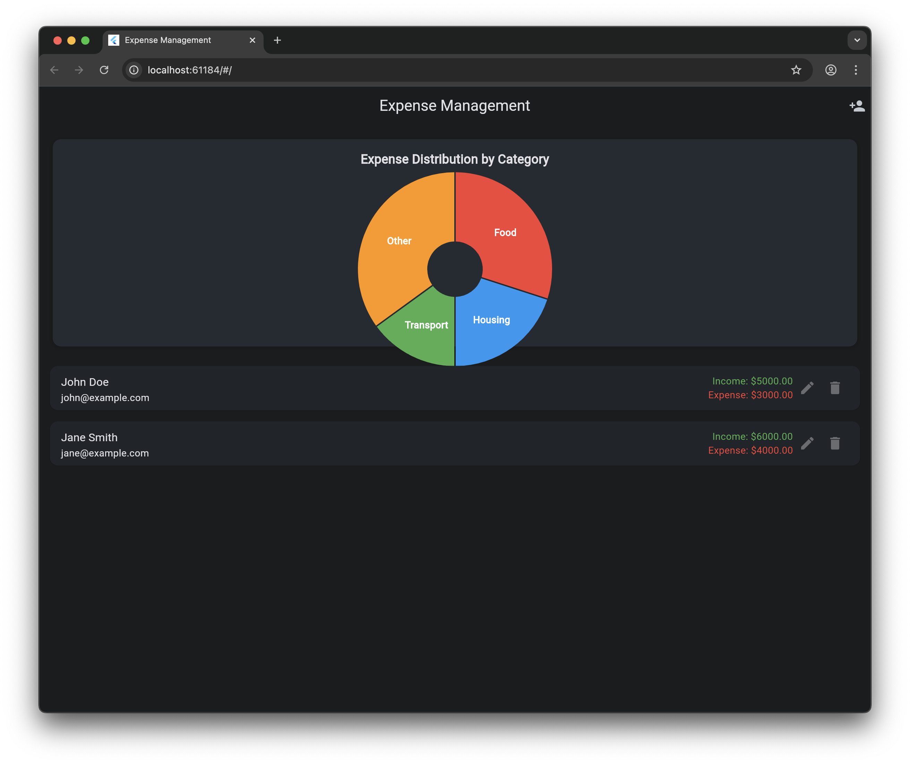

# Expense Management System



A full-stack expense management application with user registration, transaction tracking, and data visualization. Built with Flutter and React for the frontend, Java Spring Boot for the backend, and PostgreSQL for the database.

## Tech Stack

### Frontend
- Flutter (Mobile App)
- React (Web App)
  - Material-UI
  - Chart.js
  - Formik & Yup
  - Axios
  - React Router

### Backend
- Java Spring Boot
- PostgreSQL
- Docker

## Prerequisites

- Docker and Docker Compose
- Java JDK 17 or later
- Node.js 16 or later
- Flutter SDK

## Getting Started

1. Clone the repository:
```bash
git clone https://github.com/dhimant1990/expense_management.git
cd expense-management
```

2. Start the application using Docker Compose:
```bash
docker-compose up -d
```

This will start:
- PostgreSQL database
- Spring Boot backend
- React frontend

3. Access the applications:
- React Web App: http://localhost:3000
- Flutter Mobile App: Run on your device/emulator
- Backend API: http://localhost:8080

## API Endpoints

### Users
- `GET /api/users` - Get all users
- `GET /api/users/{id}` - Get user by ID
- `POST /api/users` - Create new user
- `PUT /api/users/{id}` - Update user
- `DELETE /api/users/{id}` - Delete user

### Transactions
- `GET /api/transactions/user/{userId}` - Get all transactions for a user
- `GET /api/transactions/{id}` - Get transaction by ID
- `POST /api/transactions` - Create new transaction
- `PUT /api/transactions/{id}` - Update transaction
- `DELETE /api/transactions/{id}` - Delete transaction

## Features

- User Registration and Management
- Transaction Tracking (Income/Expense)
- Category-based Expense Management
- Data Visualization (Pie Charts)
- Form Validation
- Responsive Design
- Cross-platform Support (Web & Mobile)

## Development

### Running Locally

1. Backend:
```bash
cd backend
./mvnw spring-boot:run
```

2. React Frontend:
```bash
cd react-frontend
npm install
npm start
```

3. Flutter App:
```bash
cd flutter_app
flutter pub get
flutter run
```

### Database Setup

The PostgreSQL database will be automatically configured when running with Docker Compose. For local development:

1. Create a PostgreSQL database named `expense_management`
2. Update `application.properties` with your database credentials

## Contributing

1. Fork the repository
2. Create your feature branch (`git checkout -b feature/amazing-feature`)
3. Commit your changes (`git commit -m 'Add some amazing feature'`)
4. Push to the branch (`git push origin feature/amazing-feature`)
5. Open a Pull Request

